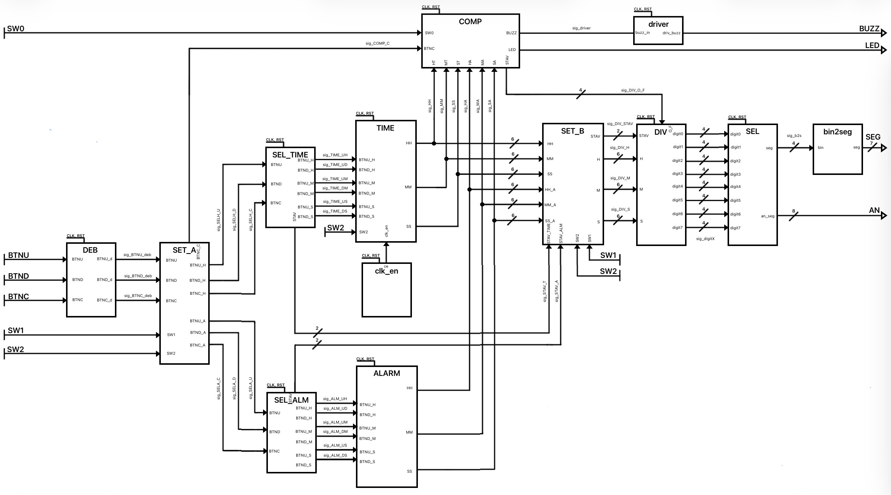

# Projekt z DE1
V rámci výuky predmetu sme si zvolili tému číslo 10 ALARM. 

## Popis alarmu a funkcionality
Nami navrhnutý alarm respektíve budík v základnom stave zobrazuje čas a aktuálny stav alarmu. Vieme samostatne nastavovať čas hodín, čas alarmu, vypínať a zapínať budík prípadne odkladať začaté budenie. Počas nastavovania jednotlivé práve navolené čislice blikajú a je zablokovaný presun do vyššieho radu takže pri prejdení hranice napríklad 59 minút sa ďalším nastavovaním vyššieho čísla nepridá minúta, iba sa minúty vynulujú. Ak náhodou nastane prípad, že niekto navolí súbežne nastavenie hodín aj alarmu, celý projekt ostane v základnom stave.

### **Ovládacie prvky a zobrazenie**
Náš projekt využíva k ovládaniu prepínače 0, 1, 2 a tlačidlá hore, dole a stred. Čas hodín rovnako ako aj nastavený čas budenia spolu so stavom zapnutia budíka sa zobrazujú na ôsmich 7-segmentovkách v tvare: HH MM SS XX. Zobrazenie času alarmu sa zobrazuje na základe vstupov z prepínačov namiesto času hodín a naopak. Po začatí budenia využívame aj externý bzučiak a LED diódu.

### **1. Nastavenie hodín**
Nastavenie hodín sa spúšťa prepínačom 2. Počas nastavovania bliká dané dvojčíslie. Presné číslo sa nastavuje tlačidlami hore a dole, následne sa potvrdzuje tlačidlom v strede a nastavovanie sa presunie na minúty a následne na sekundy.

### **2. Nastavenie alarmu**
Nastavenie alarmu je analogické s nastavením hodín. Spúšťa sa prepínačom 1. a alarm sa zapína prepínačom 0.

### **3. Posunutie alarmu**
Po začatí budenia sa zapne externý bzučiak. Alarm vieme presunúť o 5 minút (pre účely ukážky sme nastavili čas posunutia budenia na 15 sekúnd) pomocou stlačenia stredného tlačidla. Počas odloženia budenia sa rozsvieti LED k indikácii stavu, že budík je zapnutý ale iba "odložený". Úplné vypnutie nasleduje až po vypnutí prepínača 0.

## Bloková schéma

## Popis blokovej schémy
Bloková schéma respektíve top level obsahuje nasledujúce vstupy, výstupy a jednotlivé bloky popísané v nasledujúcej kapitole.

| Vstup | Signál | Popis |
|---    |---     |---|
| BTNU  | BTNU   | Tlačidlo BTNU respektíve "hore" sa využíva pre nastavenie počítadiel v bloku TIME a ALARM v prípade ak je zapnuté nastavovanie pre niektorý z                      nich|
| BTND  | BTND   | Tlačidlo BTND respektíve "dole" sa využíva pre nastavenie počítadiel v bloku TIME a ALARM v prípade ak je zapnuté nastavovanie pre niektorý z                      nich|
| BTNC  | BTNC   | Tlačidlo BTNC respektíve "stred" sa využíva pre odloženie pípania v bloku COMP za podmienky, že pípanie začalo|
| BTNR  | RST    | Tlačidlo BTNR respektíve "vpravo" sa využíva pre centrálny reset zapojenia| 
| SW0   | SW0    | Prepínač SW0 sa využíva pre blok COMP a zapína budík respektíve porovnávanie hodnôt počítadiel medzi blokmi TIME a ALARM|
| SW1   | SW1    | Prepínač SW1 využívajú bloky SET_A, SET_B a TIME. Umožňuje nastavenie času budenia, zobrazenie nastaveného času v bloku ALARM a slúži ako                          jeden z indikátorov stavu pre blok TIME|
| SW2   | SW2    | Prepínač SW2 využívajú bloky SET_A, SET_B a TIME. Umožňuje nastavenie času hodín, zobrazenie nastaveného času v bloku TIME a slúži ako                             jeden z indikátorov stavu pre blok TIME|
| E3    | CLK    | Jedná sa o interný signál s frekvenciou 100MHz|

| Výstup | Signál | Popis |
|---     |---     |---|
| JA3    | BUZZ   | Signál sa prepája cez Pmod, konkrétne výstup JA3 a GND na pasívny bzučiak.|
| LED[0] | LED    | Signál rozsvecuje LED 0 nad SW0|
| SEG[*] | SEG    | Signál rozsvecuje číslice prípadne písmená na 7 segmentovke|
| AN[*]  | AN     | Signál postupne pripája jednotlivé anódy 7 segmentoviek tak, aby bol obraz pre ľudské oko stabilný|

## Popis jednotlivých blokov
| [DEB](docs/DEB)   | [SET_A](docs/SET_A)   | [SEL_TIME](docs/SEL_TIME)   |[SEL_ALM](docs/SEL_ALM)   | [TIME](docs/TIME)   | [ALARM](docs/ALARM)
| [clk_en](docs/clk_en)   | [COMP](docs/COMP)   | [SET_B](docs/SET_B)   | [DIV](docs/DIV)   | [SEL](docs/SEL)   | [bin2seg](docs/bin2seg) | [driver](docs/driver)

>## Autori
>**Daniel Bačovčin** - návrh, top level, GitHub, práca na jednotlivých blokoch
>
>**Adam Zabloudil** - simulácie, poster, práca na jednotlivých blokoch
