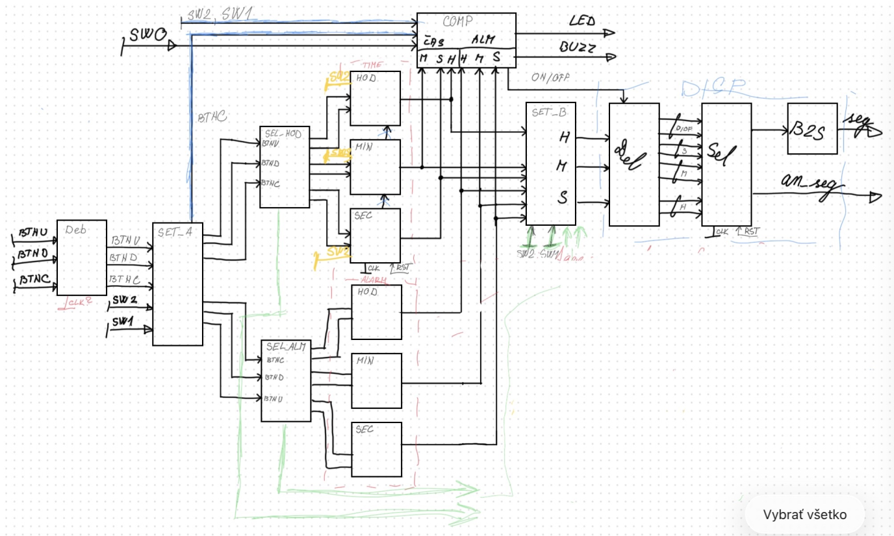

# DE1_10_Alarm_2026

## ✨ Hlavné funkcionality

> ### **1. Inicializácia a reset systému**
> Krátky popis funkcionality, čo robí po zapnutí, po resete a aký má význam v systéme.

> ### **2. Spracovanie vstupov**
> Krátky popis, ako modul prijíma a vyhodnocuje vstupy a ako reaguje na ich zmeny.

> ### **3. Generovanie výstupov**
> Krátky popis, ako sa nastavujú výstupy a od čoho závisí ich hodnota.

> ### **4. Riadiaca logika / FSM**
> Krátky popis hlavného algoritmu, stavov alebo sekvenčného správania návrhu.

## 🚀 Funkcionality projektu

### **1. Inicializácia a reset systému**
Tento modul zabezpečuje korektné spustenie systému po zapnutí napájania alebo po aktivácii reset signálu.  
Počas resetu sa všetky interné registre a riadiace signály nastavia do definovaného počiatočného stavu.

### **2. Spracovanie vstupných signálov**
Projekt prijíma vstupné signály zo zvolených vstupov a následne ich vyhodnocuje podľa definovanej logiky.  
Na základe kombinácie vstupov systém vykonáva príslušné operácie alebo mení svoj vnútorný stav.

### **3. Riadenie výstupov**
Výstupné signály sú generované na základe aktuálneho stavu systému a spracovaných vstupných hodnôt.  
Modul zabezpečuje správne nastavenie výstupov tak, aby zodpovedali požadovanej funkcionalite obvodu.

### **4. Stavový automat / hlavná riadiaca logika**
Jadro projektu tvorí riadiaci mechanizmus implementovaný pomocou stavového automatu alebo sekvenčnej logiky.  
Jednotlivé stavy reprezentujú konkrétne fázy činnosti systému a prechody medzi nimi sú podmienené vstupnými signálmi.

## Dokumentácia
- [Set_A](docs/Set_A.md)
